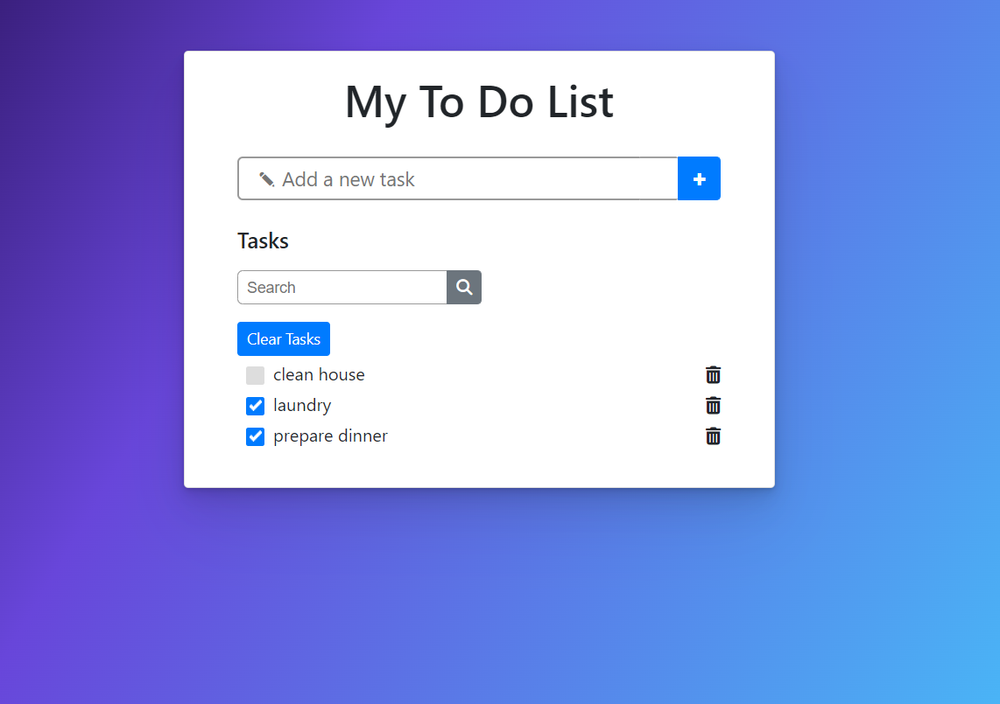

# To-Do-Task-List
This To-do task app uses vanilla JS, HTML and css.

## How to install and run it 
To install the to-do task app you need to clone the repo:

`git clone https://github.com/foteinipapadopoulou/To-Do-Task-List.git`

To run it you need to open index.html with your browser.

## Usage
You can add you own tasks that need to be done by *typing* the title and then click + button.
Then you can see all your tasks and click the tick box when it's done.
Also a delete button had been added so you can remove your task. 
There is also a search bar where you can search your tasks.

### Contributing

Pull requests are welcome. For major changes, please open an issue first
to discuss what you would like to change.
